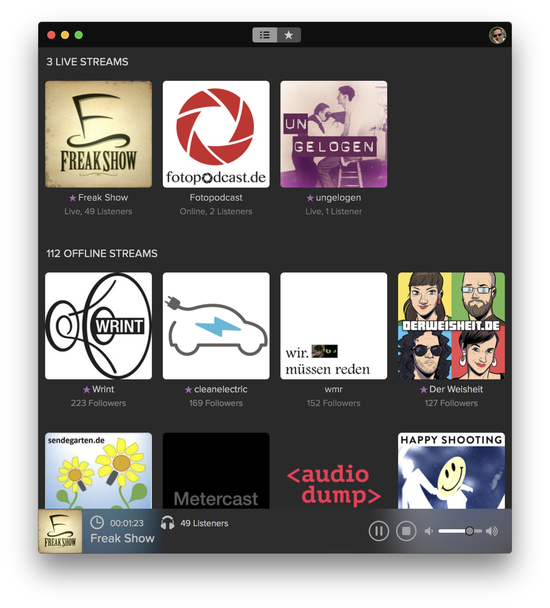

[](https://chaos.social/@phranck)
[](https://chaos.social/@Podlive)
[](http://cocoanaut.mit-license.org)
[]()

# Podlive for macOS

Podlive is a client for iOS, macOS and tvOS to listen to live streaming podcasts. We currently support all livestreams broadcasting via [Ultraschall](http://ultraschall.fm) with [Studio Link On Air](https://studio-link.de).

Our backend is a [Parse-Server](http://parseplatform.org) which is used to collect and control podcast meta data, manage push notifications and all marked favorites for each registered user.



## Support the Developer

You can download and use Podlive for macOS free of charge from the [Mac App Store](https://itunes.apple.com/at/app/podlive/id1210411572?l=en&mt=12). If you like it please be a kind person and support me on Patreon. I really, really appreciate it. It will keep me motivated to provide you with updates and even more features in the future... 😍

<div align="center""><a href="https://www.paypal.me/phranck"></a></div>

## How to contribute?
The goal to develop this software was a lag of a personal need, at the beginning. It was just a fun and hobby project, and it still is being developed under the same premise.

We really would like to see passionate developers with tons of ideas to improve and push forward this Mac client. And there is just one requirement: *I would like to see it Objective-C only*.

Please don’t get me wrong, I’m a Swift developer too. But my private passion still is on ObjC. So, Podlive for Mac may be born with the idea in mind to keep ObjC a living language, who knows (naive minded, isn’t it?)...  
And for all you Swift fans, the code style of this project looks very familiar. 😉

To contribute, just clone this project and start to develop. *Please avoid to spam us with tons of issues.* It really doesn’t help us. The best way is to fork this project, make your (changes|fixes|additions) and open a pull request. Thanks for understanding.

In order to test your code you have to use our test-backend. This requires access keys, which aren’t included in this repository.

> **NOTE: To use these keys please send a request to our [email address](mailto:mail@podlive.io?Subject=Parse-Server-Key-Request)**.

## Developer Notes
Podlive uses GitFlow. There are two branches, `master` and `develop`. The `develop` branch is our default branch. To make your (changes|fixes|additions) you just have to create your working branch with `develop` as parent. If you’re done, open a pull request.

For more detailed code guidelines please have look at the [Developer Notes](Developer-Notes.md) document.

## Work on Podlive

First you have to fork this repository into your own account. Then you follow these steps (replace `YOURACCOUNT` with your account):

```
git clone https://github.com/YOURACCOUNT/podlive-macos.git
cd podlive-macos/App
carthage update --no-use-binaries --platform macOS

git submodule init
git submodule update
```

## Contact

* :envelope: [Write us an email](mailto:mail@podlive.io)
* :bird: [Ping us on Twitter](https://twitter.com/PodliveApp)
* :memo: [Read our blog](https://podlive.io/blog)

## License
This software is published under the [MIT License](http://woodbytes.mit-license.org).

## Documentations

* [Parse macOS Guide](http://parseplatform.github.io/docs/macos/guide/)
* [Parse macOS SDK, latest](https://github.com/ParsePlatform/Parse-SDK-iOS-OSX/releases/tag/1.14.3)
* [Parse API Reference](https://parseplatform.github.io/Parse-SDK-iOS-OSX/api/)
* [Introducing Parse Push for macOS](http://blog.parse.com/announcements/introducing-parse-push-for-os-x/)
* [List of Radio-Stream URLs](http://www.chip.de/artikel/Webradio-Live-Stream-Alle-Sender-im-ueberblick_56137550.html)
* [APNS Payload Key Reference](https://developer.apple.com/library/content/documentation/NetworkingInternet/Conceptual/RemoteNotificationsPG/PayloadKeyReference.html#//apple_ref/doc/uid/TP40008194-CH17-SW1)
